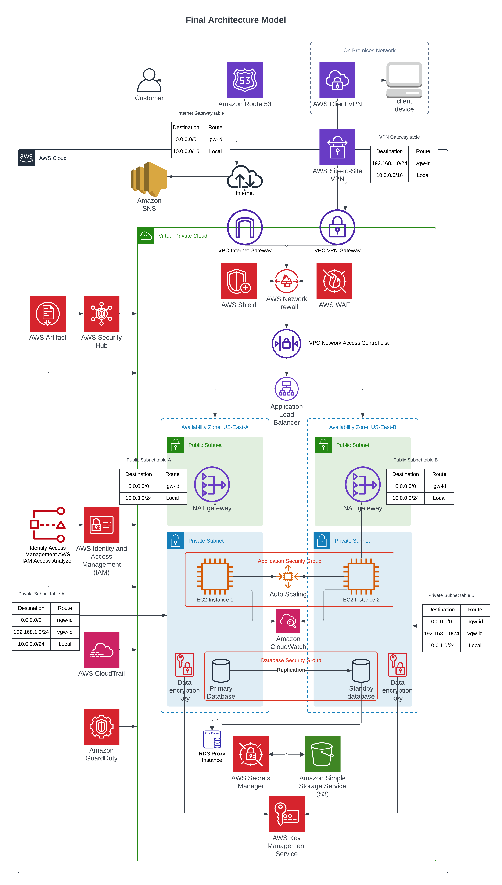

# Secure AWS Cloud Architecture — Case Study

> A high-level AWS architecture design focused on secure networking, high availability, hybrid access, monitoring, and layered cloud security.

  
  
  
  
  
  

---

## Overview

This project presents a secure and highly available AWS cloud architecture designed as part of a university assignment.

The architecture models a production-style environment with public and private networking, controlled inbound and outbound traffic, hybrid connectivity, scalable compute, secure storage, centralised monitoring, and layered security controls.

> **Note:** This repository provides a high-level overview only. Detailed configurations, code, and implementation steps have been omitted to maintain the integrity of the original university assignment.

 

  

<em>Figure 1. High-level AWS architecture diagram</em>

---

## Contents

  <a href="#project-goal">Goal</a> •
  <a href="#architecture-summary">Architecture</a> •
  <a href="#key-components">Components</a> •
  <a href="#security-design">Security Design</a> •
  <a href="#technology-stack">Stack</a> •
  <a href="#security-relevance">Security Relevance</a> •
  <a href="#limitations">Limitations</a> •
  <a href="#future-improvements">Future Improvements</a>

---

## Project Goal

The goal of this project was to design an AWS environment that could support real-world workloads while considering:

- Network segmentation
- Secure external access
- Hybrid connectivity
- High availability
- Scalable compute
- Data protection
- Threat detection
- Monitoring and auditability

The focus was on designing a cloud architecture that balances availability, security, and operational visibility.

---

## Architecture Summary

At a high level, the architecture includes:

- Route 53 for DNS routing
- A multi-AZ VPC with public and private subnets
- Internet Gateway and NAT Gateway for controlled connectivity
- Application Load Balancer for public-facing traffic
- EC2 instances in private subnets
- Auto Scaling Groups for workload scalability
- RDS with high availability and RDS Proxy
- S3 for secure object storage
- IAM, KMS, Secrets Manager, GuardDuty, Security Hub, CloudTrail, and CloudWatch for security and monitoring

The design separates public-facing components from private workloads and applies security controls across the network, application, identity, and data layers.

---

## Key Components

| Area | AWS Services / Controls |
|:---:|:---:|
| DNS & Routing | Amazon Route 53 |
| Networking | VPC, Public Subnets, Private Subnets, Internet Gateway, NAT Gateway |
| Hybrid Connectivity | Site-to-Site VPN, Client VPN |
| Compute | EC2, Auto Scaling Groups |
| Load Balancing | Application Load Balancer |
| Database | Amazon RDS, RDS Proxy |
| Storage | Amazon S3 |
| Identity & Access | IAM |
| Encryption & Secrets | AWS KMS, AWS Secrets Manager |
| Threat Detection | Amazon GuardDuty, AWS Security Hub |
| Edge & Network Protection | AWS WAF, AWS Shield, AWS Network Firewall |
| Monitoring & Logging | Amazon CloudWatch, AWS CloudTrail |
| Compliance Reference | AWS Artifact |

---

## Security Design

### Network Segmentation

The architecture separates resources across public and private subnets. Public subnets are used for internet-facing components such as the Application Load Balancer, while application workloads and databases are placed in private subnets.

This reduces direct exposure of backend systems and supports a more controlled traffic flow.

### Controlled Inbound and Outbound Access

Inbound user traffic is routed through DNS and the Application Load Balancer before reaching backend workloads. Outbound internet access from private resources is controlled through NAT Gateways rather than exposing those resources directly to the internet.

### Identity and Access Control

IAM is used to control access to AWS resources using role-based permissions and least-privilege principles. KMS and Secrets Manager support secure handling of encryption keys and sensitive credentials.

### Data Protection

Data protection is supported through encrypted storage, secure object storage policies, managed secrets, and database high availability. RDS is designed with primary-standby replication and RDS Proxy to improve resilience and connection management.

### Monitoring and Auditability

CloudWatch provides operational visibility through logs, metrics, dashboards, and alarms. CloudTrail records API activity to support investigation, auditability, and compliance review.

### Threat Detection and Layered Defence

GuardDuty, Security Hub, AWS WAF, Shield, and Network Firewall provide layered security monitoring and protection across identity, network, and application layers.

---

## Technology Stack

| Area | Services |
|:---:|:---:|
| Cloud Provider | AWS |
| Networking | VPC, Subnets, Route 53, NAT Gateway, Internet Gateway |
| Connectivity | Site-to-Site VPN, Client VPN |
| Compute | EC2, Auto Scaling Groups, Application Load Balancer |
| Database | RDS, RDS Proxy |
| Storage | S3 |
| Security | IAM, KMS, Secrets Manager, WAF, Shield, Network Firewall |
| Detection & Governance | GuardDuty, Security Hub, AWS Artifact |
| Monitoring & Audit | CloudWatch, CloudTrail |

---

## Security Relevance

This project demonstrates cloud security and architecture knowledge relevant to junior cloud, cybersecurity, GRC, and infrastructure roles:

- Secure AWS architecture design
- VPC segmentation and subnet planning
- Public and private workload separation
- Hybrid connectivity design
- IAM and least-privilege access control
- Encryption and secret management
- Cloud monitoring and audit logging
- High availability and fault-tolerant design
- Layered defence using AWS-native security services
- Translating security requirements into cloud architecture decisions

---

## Limitations

This repository is intentionally high-level and does not include detailed configuration files, deployment scripts, or implementation steps.

Current limitations include:

- No Infrastructure as Code included
- No detailed IAM policies provided
- No deployment walkthrough
- No cost analysis
- No live AWS environment access
- Architecture shown as a design case study rather than an active production deployment

---

## Future Improvements

To align more closely with enterprise-grade cloud environments, future iterations could include:

- Infrastructure as Code using Terraform or AWS CDK
- CI/CD pipelines using GitHub Actions or AWS CodePipeline
- Federated identity using AWS IAM Identity Center, Okta, or Azure AD
- Cross-region backup and disaster recovery
- Transit Gateway for more complex VPC connectivity
- Containerised workloads using ECS or EKS
- Serverless components using AWS Lambda
- Centralised security logging and SIEM integration
- Cost optimisation review
- Well-Architected Framework assessment

---

## Disclaimer

This repository is a high-level portfolio case study based on a university cloud architecture assignment. Detailed configuration, code, and implementation steps have been omitted to preserve academic integrity.
